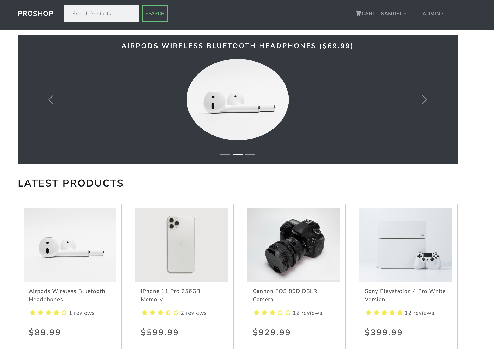

# 📦 Ecommerce Platform (Django REST + React + Redux)

A full-stack ecommerce web application built with **Django REST Framework** for backend APIs and **React + Redux** for the frontend.  
The project includes product browsing, cart management, JWT authentication, checkout flow, PayPal integration, and admin controls.

## 📸 Screenshots

## 📸 Screenshots

### 🏠 Home Screen


### 💳 Payment Screen


### 🛠️ Product Admin Screen


### 👤 Profile Screen

## 

## 🚀 Tech Stack

### Frontend
- React
- Redux
- React Router
- Axios

### Backend
- Django
- Django REST Framework
- SimpleJWT (JWT Authentication)
- SQLite (development)

### Payments
- PayPal REST SDK

## ✨ Features

### 🛍️ Shopping
- View product list and details  
- Ratings & reviews  
- Add/remove items from cart  
- Update quantities  
- Redux-powered global cart state  

### 👤 Users
- Register & login using JWT  
- Update profile  
- View order history  
- Protected routes  

### 💳 Checkout
- Shipping details  
- Payment method selection  
- PayPal checkout  
- Order summary  

### 🛠️ Admin
- Create / edit / delete products  
- Manage users  
- View all orders  
- Mark orders as delivered  

## 🏗️ Architecture Overview

### Backend (Django REST Framework)
- `views.py` → API endpoints  
- `serializers.py` → data validation  
- `urls.py` → routing  
- JWT authentication via SimpleJWT  
- SQLite for development  

### Frontend (React + Redux)
- Actions + reducers for user, product, order, cart  
- Axios for API calls  
- React Router for navigation  
- Reusable components  

## 🔐 Authentication (JWT)

1. User logs in  
2. Django returns access + refresh tokens  
3. Tokens stored in localStorage  
4. Axios sends `Authorization: Bearer <token>`  
5. Protected routes require valid token  

## ⚙️ Installation

### 1. Clone the repo
```bash
git clone <repo-url>
cd ecommerce-platform
```

### 2. Backend setup
```bash
cd backend
pip install -r requirements.txt
python manage.py migrate
python manage.py runserver
```

### 3. Frontend setup
```bash
cd frontend
npm install
npm start
```

## 📁 Project Structure

/backend  
/frontend  
README.md  

## 🧭 Future Improvements
- Deployment  
- PostgreSQL upgrade  
- Search filters  
- Wishlist  
- Email notifications  

